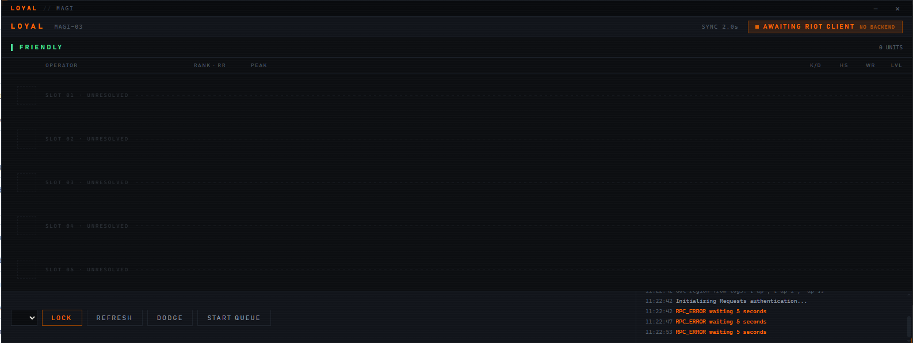

# LOYAL

An unofficial desktop companion for **VALORANT** that reads the local Riot
Client state and presents a compact lobby readout: player ranks, peak ranks,
RR, recent competitive statistics, party grouping, teams, and equipped skins.

> **Unofficial project.** LOYAL is not affiliated with or endorsed by Riot
> Games. Use it at your own risk and follow Riot Games' terms and policies.

## Preview



The current interface is a dark tactical readout designed for fast scanning:
it separates friendly players, rank/RR, peak rank, recent performance, party
context, and connection status without requiring a separate browser dashboard.

## Features

- Works across menus, agent select, and live matches.
- Enriches lobby players with rank, peak rank, RR, K/D, headshot percentage,
  party, team, and skin data when available.
- Starts its UI immediately and waits safely for the Riot Client.
- Optional Discord Rich Presence integration.
- Local rotating logs with privacy-preserving logging enabled by default.

## Origin and attribution

LOYAL began as a fork of [zayKenyon/VALORANT-rank-yoinker](https://github.com/zayKenyon/VALORANT-rank-yoinker).
The project retains the original idea of reading the local Riot Client and
displaying lobby intelligence, while this repository adds and/or substantially
reworks the MAGI UI, asynchronous startup, state handling, player enrichment,
privacy defaults, logging, and tests. The history and upstream relationship
are intentionally disclosed here rather than presenting the work as wholly
original.

Development has been AI-assisted, including code generation, refactoring,
debugging, documentation, and test-writing. Human review and local testing
remain necessary, especially because Riot Client APIs can change.

## Requirements

- Windows
- Python 3.10+
- VALORANT and the Riot Client installed locally

## Installation

```powershell
git clone <repository-url>
cd loyal-main
python -m venv .venv
.\.venv\Scripts\Activate.ps1
python -m pip install -r requirements.txt
python main.py
```

Start VALORANT normally before launching LOYAL. The app does not require or
store a separate Riot username, password, API key, or token; it uses the local
Riot Client lockfile and session endpoints while the client is running.

## Privacy and security

- Riot session data is read locally and is not intentionally uploaded by this
  project.
- Decoded private presence data is **not** logged by default.
- Do not publish lockfiles, exported logs, screenshots containing player IDs,
  or local configuration files.
- The lockfile password is handled in memory by the client integration and is
  not intended to be committed or displayed.

## Project layout

| Path | Purpose |
| --- | --- |
| `main.py` | Application entry point |
| `app_backend.py` | Polling and state orchestration |
| `Request1.py` | Local Riot Client authentication and HTTP wrapper |
| `presence.py` | Presence decoding and game-state detection |
| `States/` | Menu, pre-game, and in-game handlers |
| `rank.py`, `player_stats.py`, `skins.py` | Player enrichment services |
| `gui/` | Webview UI and presentation logic |
| `tests/` | Unit tests for UI derivation logic |

## Testing

```powershell
python -m pytest -q
```

Tests do not replace validation against a running Riot Client. API schemas and
client behaviour can change without notice.

## License

No license has been selected yet. Until one is added, all rights are reserved.
